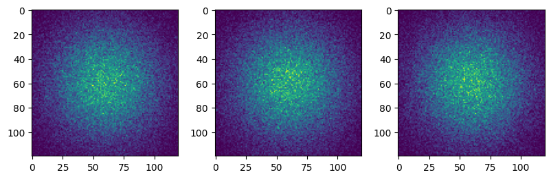
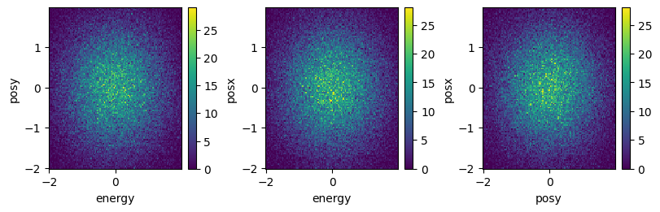

Binning demonstration on locally generated fake data
~~~~~~~~~~~~~~~~~~~~~~~~~~~~~~~~~~~~~~~~~~~~~~~~~~~~

In this example, we generate a table with random data simulating a
single event dataset. We showcase the binning method, first on a simple
single table using the bin_partition method and then in the distributed
mehthod bin_dataframe, using daks dataframes. The first method is never
really called directly, as it is simply the function called by the
bin_dataframe on each partition of the dask dataframe.

.. code:: ipython3

    import sys
    
    import dask
    import numpy as np
    import pandas as pd
    import dask.dataframe
    
    import matplotlib.pyplot as plt
    
    sys.path.append("../")
    from sed.binning import bin_partition, bin_dataframe

Generate Fake Data
------------------

.. code:: ipython3

    n_pts = 100000
    cols = ["posx", "posy", "energy"]
    df = pd.DataFrame(np.random.randn(n_pts, len(cols)), columns=cols)
    df

.. raw:: html

    

    
    <table border="1" class="dataframe">
      <thead>
        <tr style="text-align: right;">
          <th></th>
          <th>posx</th>
          <th>posy</th>
          <th>energy</th>
        </tr>
      </thead>
      <tbody>
        <tr>
          <th>0</th>
          <td>-0.892244</td>
          <td>-1.459783</td>
          <td>0.311661</td>
        </tr>
        <tr>
          <th>1</th>
          <td>0.063908</td>
          <td>-0.355335</td>
          <td>0.651465</td>
        </tr>
        <tr>
          <th>2</th>
          <td>0.597229</td>
          <td>-0.429607</td>
          <td>-0.370872</td>
        </tr>
        <tr>
          <th>3</th>
          <td>-0.481183</td>
          <td>-0.139158</td>
          <td>-0.314332</td>
        </tr>
        <tr>
          <th>4</th>
          <td>1.105455</td>
          <td>-0.189231</td>
          <td>0.412213</td>
        </tr>
        <tr>
          <th>...</th>
          <td>...</td>
          <td>...</td>
          <td>...</td>
        </tr>
        <tr>
          <th>99995</th>
          <td>0.281058</td>
          <td>-1.276818</td>
          <td>-1.487001</td>
        </tr>
        <tr>
          <th>99996</th>
          <td>-0.205844</td>
          <td>-0.600267</td>
          <td>-0.126838</td>
        </tr>
        <tr>
          <th>99997</th>
          <td>-1.167711</td>
          <td>-0.598229</td>
          <td>-0.341410</td>
        </tr>
        <tr>
          <th>99998</th>
          <td>0.345514</td>
          <td>-0.203688</td>
          <td>-0.598167</td>
        </tr>
        <tr>
          <th>99999</th>
          <td>0.138462</td>
          <td>-0.730779</td>
          <td>-2.268035</td>
        </tr>
      </tbody>
    </table>
    
100000 rows × 3 columns

    

Define the binning range
------------------------

.. code:: ipython3

    binAxes = ["posx", "posy", "energy"]
    nBins = [120, 120, 120]
    binRanges = [(-2, 2), (-2, 2), (-2, 2)]
    coords = {ax: np.linspace(r[0], r[1], n) for ax, r, n in zip(binAxes, binRanges, nBins)}

Compute the binning along the pandas dataframe
----------------------------------------------

.. code:: ipython3

    %%time
    res = bin_partition(
        part=df,
        bins=nBins,
        axes=binAxes,
        ranges=binRanges,
        hist_mode="numba",
    )

.. parsed-literal::

    CPU times: user 1.32 s, sys: 31.5 ms, total: 1.35 s
    Wall time: 1.39 s

.. code:: ipython3

    fig, axs = plt.subplots(1, 3, figsize=(8, 2.5), constrained_layout=True)
    for i in range(3):
        axs[i].imshow(res.sum(i))

Transform to dask dataframe
---------------------------

.. code:: ipython3

    ddf = dask.dataframe.from_pandas(df, npartitions=50)
    ddf

.. raw:: html

    
<strong>Dask DataFrame Structure:</strong>

    

    
    <table border="1" class="dataframe">
      <thead>
        <tr style="text-align: right;">
          <th></th>
          <th>posx</th>
          <th>posy</th>
          <th>energy</th>
        </tr>
        <tr>
          <th>npartitions=50</th>
          <th></th>
          <th></th>
          <th></th>
        </tr>
      </thead>
      <tbody>
        <tr>
          <th>0</th>
          <td>float64</td>
          <td>float64</td>
          <td>float64</td>
        </tr>
        <tr>
          <th>2000</th>
          <td>...</td>
          <td>...</td>
          <td>...</td>
        </tr>
        <tr>
          <th>...</th>
          <td>...</td>
          <td>...</td>
          <td>...</td>
        </tr>
        <tr>
          <th>98000</th>
          <td>...</td>
          <td>...</td>
          <td>...</td>
        </tr>
        <tr>
          <th>99999</th>
          <td>...</td>
          <td>...</td>
          <td>...</td>
        </tr>
      </tbody>
    </table>
    

    
Dask Name: from_pandas, 1 graph layer

compute distributed binning on the partitioned dask dataframe
-------------------------------------------------------------

In this example, the small dataset does not give significant improvement
over the pandas implementation, at least using this number of
partitions. A single partition would be faster (you can try…) but we use
multiple for demonstration purpouses.

.. code:: ipython3

    %%time
    res = bin_dataframe(
        df=ddf,
        bins=nBins,
        axes=binAxes,
        ranges=binRanges,
        hist_mode="numba",
    )

.. parsed-literal::

      0%|          | 0/50 [00:00<?, ?it/s]

.. parsed-literal::

    CPU times: user 650 ms, sys: 295 ms, total: 945 ms
    Wall time: 833 ms

.. code:: ipython3

    fig, axs = plt.subplots(1, 3, figsize=(8, 2.5), constrained_layout=True)
    for dim, ax in zip(binAxes, axs):
        res.sum(dim).plot(ax=ax)

